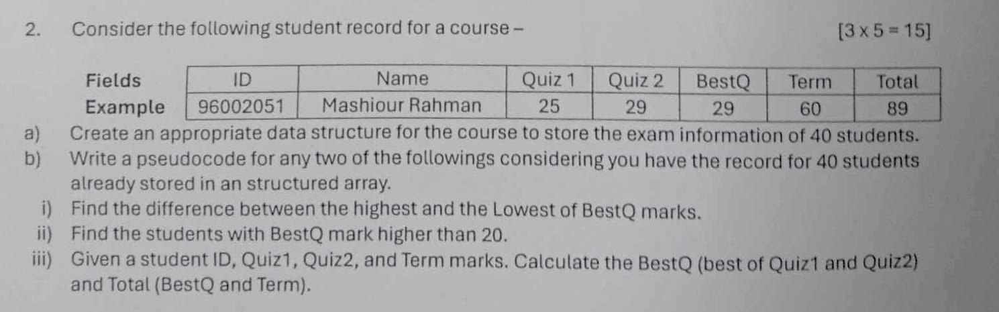

**a) Data Structure:**

A structured array or a list of structures would be an appropriate data structure.  Each structure would represent a student's record and contain the following fields:

```c
struct Student {
  int ID;
  string Name;
  int Quiz1;
  int Quiz2;
  int BestQ;
  int Term;
  int Total;
};

Student students[40]; // An array to hold 40 student records
```

**b) Pseudocode:**

**i) Difference between Highest and Lowest BestQ Marks:**

```cpp
function findBestQDifference(students):
  if students is empty:
    return "Error: No students in the list"

  highestBestQ = 0  // Assume BestQ is non-negative
  lowestBestQ = infinity // Use a very large value

  for each student in students:
    if student.BestQ > highestBestQ:
      highestBestQ = student.BestQ
    if student.BestQ < lowestBestQ:
      lowestBestQ = student.BestQ

  return highestBestQ - lowestBestQ

```


**ii) Students with BestQ Mark Higher than 20:**

```cpp
function findStudentsWithHighBestQ(students):
  highBestQStudents = [] // Initialize an empty list

  for each student in students:
    if student.BestQ > 20:
      add student to highBestQStudents

  return highBestQStudents 
```

**iii) Calculate BestQ and Total:**

```cpp
function calculateBestQandTotal(ID, Quiz1, Quiz2, Term):
  BestQ = max(Quiz1, Quiz2)
  Total = BestQ + Term
  return BestQ, Total


function updateStudentRecord(students, ID, Quiz1, Quiz2, Term):
  for each student in students:
    if student.ID == ID:
        BestQ, Total = calculateBestQandTotal(Quiz1, Quiz2, Term)
        student.BestQ = BestQ
        student.Total = Total
        return // Stop searching once the student is found and updated
  print "Student with ID", ID, "not found."  // Handle the case where the ID is not in the array.

```


**Explanation:**

* The data structure uses a `struct` (or similar structure mechanism depending on the language) to group the related information for each student.
* The pseudocode provides clear steps for each task.
* The `calculateBestQandTotal` function efficiently determines the `BestQ` and `Total` scores.
* The `updateStudentRecord` function searches for a student based on their ID, calculates and updates their `BestQ` and `Total`, and includes error handling for when the student ID isn't found.  This is an improvement over simply calculating and returning the values without storing them in the structured array.


This provides a complete solution with a suitable data structure and efficient pseudocode for the requested tasks.  Remember to adapt the syntax to the specific programming language you are using.

4. **Return Values:** The function returns both the calculated `bestQ` and `total` (either as an array with two elements, or as a structure with `bestQ` and `total` fields). You could then use these returned values to update the relevant student record in the larger `students` array, display them, or use them in other calculations.


If you were updating the student records, you would add logic to find the student in the array using their ID and then update their `BestQ` and `Total` fields with the calculated values.
